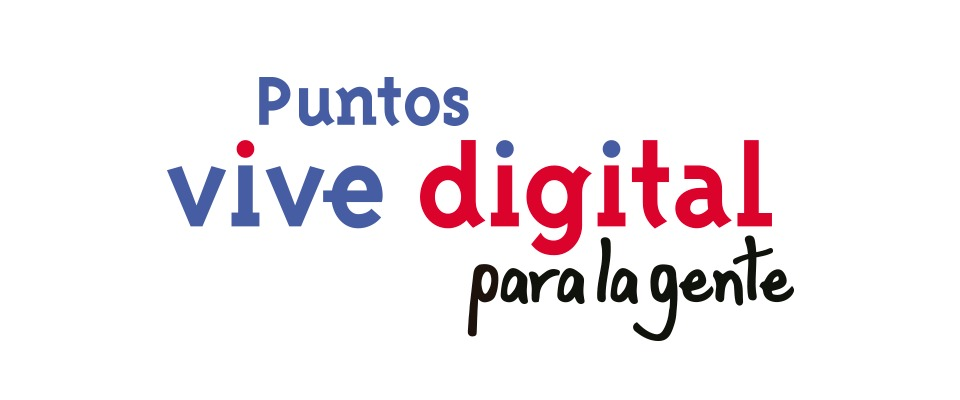

<div align="center">



# Sistema de Gestión — Puntos Vive Digital

**Aplicación web para la administración integral de los Puntos Vive Digital (PVD)
de la Alcaldía Municipal de Bugalagrande, Valle del Cauca (Colombia).**


</div>

---

## ¿Qué hace este sistema?

Digitaliza la operación diaria de los Puntos Vive Digital del municipio: registro de
ciudadanos y atenciones, préstamo de recursos tecnológicos, reserva de salas, cursos con
control de asistencia, mantenimientos de equipos, evidencias fotográficas, encuestas de
satisfacción y reportes estadísticos exportables a Excel — todo con control de acceso por
roles y trazabilidad completa de las acciones.

Lo usan los administradores de cada punto y el personal TIC de la Alcaldía desde el
navegador, sin instalar nada en los equipos de los usuarios.

## Características destacadas

- 🏢 **Multi-sede**: cada administrador solo ve y gestiona su propio punto; el personal TIC tiene visión global.
- 🔐 **RBAC propio**: matriz de permisos por rol, delegación controlada y sobreescritura individual por usuario.
- 🛡️ **Seguridad**: bloqueo de fuerza bruta en el login (Redis), HTTPS obligatorio con HSTS, aislamiento estricto de datos entre sedes y registro de auditoría de todas las acciones.
- ⚖️ **Habeas data**: registro de ciudadanos con consentimiento explícito conforme a la Ley 1581 de 2012.
- 📊 **Reportes**: KPIs, perfil demográfico de los ciudadanos atendidos, gráficas por mes/servicio/sede y 5 exportaciones a Excel con formato institucional.
- 🔄 **Despliegue automatizado**: un solo script instala todo el stack de producción, emite el certificado SSL y programa el respaldo diario de la base de datos (30 días de retención).

## Módulos del sistema

| Módulo | Descripción |
|---|---|
| **Panel de control** | Dashboard con KPIs y acceso rápido según el rol |
| **Ciudadanos** | Registro, historial y gestión de ciudadanos atendidos |
| **Atenciones** | Registro de atenciones con servicios y encuesta de satisfacción |
| **Recursos / Préstamos** | Inventario de recursos y control de préstamos |
| **Salas / Habilitaciones** | Gestión de salas y agenda semanal |
| **Cursos** | Talleres, sesiones, inscripciones y asistencia |
| **Mantenimientos** | Registro de mantenimiento de equipos |
| **Evidencias** | Registro fotográfico de actividades (no público) |
| **Reportes** | Estadísticas, gráficas y exportación a Excel |
| **Puntos PVD** | Administración de sedes |
| **Usuarios y permisos** | Cuentas, matriz RBAC y delegación de permisos |
| **Auditoría** | Trazabilidad de quién hizo qué y cuándo |

## Roles de usuario

| Rol | Alcance |
|---|---|
| **Superusuario** | Acceso total al sistema |
| **Administrador TIC** | Gestión global — ve todas las sedes |
| **Administrador PVD** | Solo gestiona su(s) sede(s) asignada(s) |

## Stack tecnológico

| Capa | Tecnología |
|---|---|
| Backend | Python 3.13 · Django 5.x |
| Base de datos | MySQL 8 |
| Frontend | Plantillas de Django · CSS propio (`pvd-theme.css`), sin frameworks JS |
| Exportación | openpyxl (Excel con formato) |
| Seguridad de login | Redis (conteo de intentos fallidos entre procesos) |
| Producción | Ubuntu · Nginx · Gunicorn · systemd · Certbot (Let's Encrypt) · WhiteNoise |

## Estructura del proyecto

```
software-puntos-vive-digital/
├── core/                        # Configuración Django (settings, urls, wsgi)
├── modulo_puntos/               # Aplicación principal
│   ├── models.py                # Todos los modelos del sistema
│   ├── views/                   # Vistas organizadas por módulo (14 archivos)
│   │   ├── atenciones.py · ciudadanos.py · cursos.py · recursos.py
│   │   ├── salas.py · mantenimientos.py · evidencias.py · reportes.py
│   │   └── exportaciones.py · permisos.py · usuarios.py · auth.py · ...
│   ├── forms.py                 # Formularios con validación
│   ├── context_processors.py    # Navegación, breadcrumb y topbar globales
│   ├── utils.py                 # Auditoría y permisos RBAC
│   ├── middleware.py            # Protecciones a nivel de petición
│   ├── tests.py                 # Pruebas automatizadas
│   └── management/commands/     # Comandos propios (importación masiva de ciudadanos)
├── templates/                   # Plantillas HTML (sistema + login)
├── static/                      # Tema CSS, scripts e imágenes institucionales
├── deploy/                      # setup.sh, nginx, systemd y respaldo automático
├── docs/                        # Documentación entregada a la Alcaldía
└── requirements.txt
```

## Instalación local (desarrollo)

```bash
# 1. Clonar el repositorio
git clone https://github.com/esaenzsalazar/software-puntos-vive-digital.git
cd software-puntos-vive-digital

# 2. Crear y activar el entorno virtual
python3 -m venv entorno
source entorno/bin/activate          # Linux / macOS
# entorno\Scripts\activate           # Windows

# 3. Instalar dependencias
pip install -r requirements.txt

# 4. Configurar variables de entorno
cp .env.example .env                 # editar con los datos de la base de datos

# 5. Migraciones y arranque
python manage.py migrate
python manage.py runserver
```

Las variables requeridas están documentadas en `.env.example` (clave secreta de Django,
conexión MySQL, Redis y dominios permitidos). El proyecto no contiene credenciales en el código.

## Despliegue en producción

El repositorio incluye la instalación automatizada completa para un servidor Ubuntu:

```bash
sudo bash deploy/setup.sh
```

El script instala el stack (Nginx, Gunicorn, Redis, Certbot), deja la aplicación corriendo
como servicio del sistema, activa HTTPS con redirección forzada y programa el respaldo
diario de la base de datos. Detalle completo en `docs/Requisitos_Infraestructura_PVD.pdf`.

## Documentación

| Archivo | Contenido |
|---|---|
| `docs/Manual_Sistema_PVD.pdf` | Manual de usuario + descripción funcional + estructura de la base de datos |
| `docs/Requisitos_Infraestructura_PVD.pdf` | Requisitos técnicos del servidor de producción |
| `docs/Solicitud_Infraestructura_PVD.pdf` | Solicitud formal de infraestructura con costos |
| `docs/RESPALDOS.md` | Estrategia de respaldo y restauración |

---

<div align="center">

Desarrollado por **Esteban Sáenz Salazar** para la Alcaldía Municipal de Bugalagrande
(contrato CD-224-2026 · 2026)

*Valle del Cauca · Colombia*

</div>
